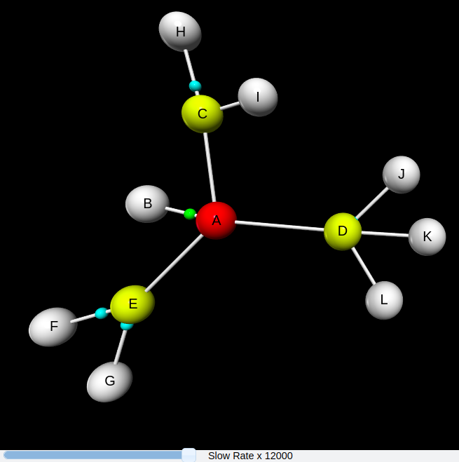

# Implementation of the MAC layer in a discrete event simulator for the 802.15.4 protocol based on SimPy
This work proposes a discrete event simulator generated with the help of Python's SimPy library, whose learning curve is much faster compared to other programming languages, in addition to the fact that this language allows interoperability between different operating systems and even between different architectures, so there is no need to compile or adjust the libraries created in the implementation of the simulator. Specifically, this work concentrates only on the MAC layer of the 802.15.4 protocol.

## System operation
The simulator is made up of 7 classes, which were programmed in their entirety and when coexisting in an environment they reproduce the behavior of the MAC layer of the 802.15.4 protocol.

### Node class

The node class contains the main functions specified in the IEEE 802.15.4 standard. Among these functions are, for example, the time a node must wait for an ACK frame after transmitting a data packet or commands, the number of retransmission attempts of a packet after reaching the maximum value of the exponential backoff. In this class, the functions were classified as main, secondary and auxiliary. 

The main functions are the essential processes within the simulation, for example, the CSMA_CA_UNS() method. The CCA() method is responsible for performing the clear channel assessment process. There is also the creation, transmission and reception of packets, among others.

The secondary functions are those whose function is auxiliary to the primary ones, basically they perform calculations such as the probability(P) method which receives as parameter the probability of success of an event and based on this returns a status (true or false). 

Finally, the auxiliary functions are methods that support other functions that cannot be executed directly during the simulation, an example is the auxACKRx() function, which is in charge of calling the ACKRx()} function and of performing the pertinent configuration so that said function is executed normally, In this case, the first method can be interrupted by the second, since all processes are carried out within the ACKRx() function. If auxACKRx() did not exist and the processes were tried to be interrupted from the ACKRx() method, the simulation would fail because SimPy does not allow a function to interrupt itself.

### PAN node class

This class is in charge of creating and initializing the nodes that make up the network together with their processes. Each node is assigned a role within the network as coordinator or device and the commands it can use.

To create the communications network, first the channel is built, through which the processes of transmission and reception of packets will take place, and then each generated node is assigned a list of devices with which it will be able to communicate, known as neighbors. 

It is important to mention that the PAN node inherits all the methods and attributes of the node class, since the device assigned as network coordinator does not lose its nature as a node.

### Packet class

The class for generating package type objects is made up of attributes that identify the source node, as well as the node to which it is addressed. It also has characteristic parameters of the packet such as the sequence number, the size in bytes, the number of retransmission attempts, the type of frame (data, command or acknowledge) and whether acknowledgement is required.

### Channel class

The channel class is designed in such a way that several simultaneous transmissions can coexist regardless of whether they collide or are successful, since, being a wireless medium, more than one node can comply with the conditions established by the standard and transmit at the same instant of time.

This class is responsible for discerning whether a communication link between two nodes is successful or is interrupted by some other transmission, since its attributes store data such as the nodes that are transmitting and the packets they are sending. If a collision occurs, this class is in charge of indicating that the packets involved contain errors and that it is due to interference.

### Print class

This class is in charge of gathering the most relevant data of each process executed during the simulation and at the same time displaying them in a summarized and understandable way so that the user can perform a better analysis of the information. The functions of this class are composed of the methods that focus on printing data in the console and a method that is intended for the compilation of data in a text file.

It is important to mention that the printing in console is controlled by the user, that is, the user can enable or disable it in case he does not require so much information, but whenever the simulator is started, a text file will be generated, which will contain a report of the transmission and reception processes of packets. This text file shows the most important events that occur during the simulation, this has a user-friendly format, since it is important to be able to interpret the information collected in it, in order to facilitate the manipulation of the data, for example, it can be very useful when it is required to filter a specific event. 

### Animation

In order to perform the animation, the script uses the networkx and vpython libraries. The former specializes in the study of complex network functions, and the latter facilitates the creation of navigable 3D screens and animations.

It is important to note that this script is aimed at users who find it difficult to analyze the information from both the console and the text file and need something more graphical to understand how the processes are developing, therefore, it is the user's choice whether or not to create the animation.

To create the animation, first the simulation process must be executed, since the animation script has as input the text file resulting from the simulation. 

An example of the animation is shown in the following figure.

